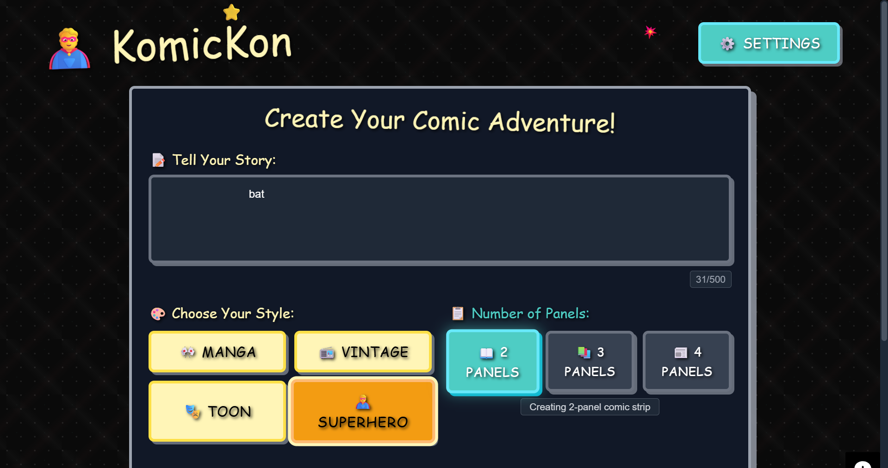

# 🦸 KomicKon - AI Comic Creator

 
KomicKon is a fun, single-page web application that uses the power of AI to turn your stories into multi-panel comic strips. With a vibrant, comic-book-themed interface, you can choose your art style, select the number of panels, and bring your imagination to life!

**Live Demo:** [**https://kool-k.github.io/KomicKon/**](https://kool-k.github.io/KomicKon/)
---

### ## ✨ Features

- **AI-Powered Generation:** Turns your text prompts into visual comic panels.
- **Bring Your Own Key (BYOK):** Securely use your own API keys from various providers. Your keys are stored only in your browser's `localStorage` and never on a server.
- **Multiple AI Providers:** Supports a range of popular image generation models, including OpenAI DALL-E, Replicate, and more.
- **Customizable Styles:** Choose from different artistic styles like Manga, Vintage, Toon, or Superhero.
- **Variable Panel Count:** Create stories with 2, 3, or 4 panels.
- **Fully Responsive:** A beautiful, mobile-first design that works on any device.
- **Themed UI:** An immersive dark-mode interface with a fun, comic book aesthetic.

---

### ## 🛠️ Tech Stack

- **Frontend:** HTML5, Tailwind CSS, Vanilla JavaScript
- **Build Tool:** Vite
- **Deployment:** Netlify, GitHub Pages

---

### ## 🚀 Getting Started

To run this project locally, follow these steps:

1.  **Clone the repository:**
    ```bash
    git clone [https://github.com/YOUR_USERNAME/KomicKon.git](https://github.com/YOUR_USERNAME/KomicKon.git)
    ```

2.  **Navigate to the project directory:**
    ```bash
    cd KomicKon
    ```

3.  **Install dependencies:**
    This project uses `yarn` as its package manager.
    ```bash
    yarn install
    ```

4.  **Run the development server:**
    ```bash
    yarn run dev
    ```
    Open your browser and navigate to `http://localhost:5173` (or the address shown in your terminal).

---

### ## ⚙️ How It Works: The BYOK Model

KomicKon uses a "Bring Your Own Key" model to handle AI image generation.

1.  **Get an API Key:** Sign up for a service like [Replicate](https://replicate.com) to get a free API key and initial credits.
2.  **Add Your Key:** Click the "Settings" ⚙️ icon in the app.
3.  **Save Securely:** Paste your API key. It will be saved securely in your browser's local storage and is never sent to any server except to the AI provider you choose during generation.
4.  **Start Creating!** You can now generate comics using your own credits.